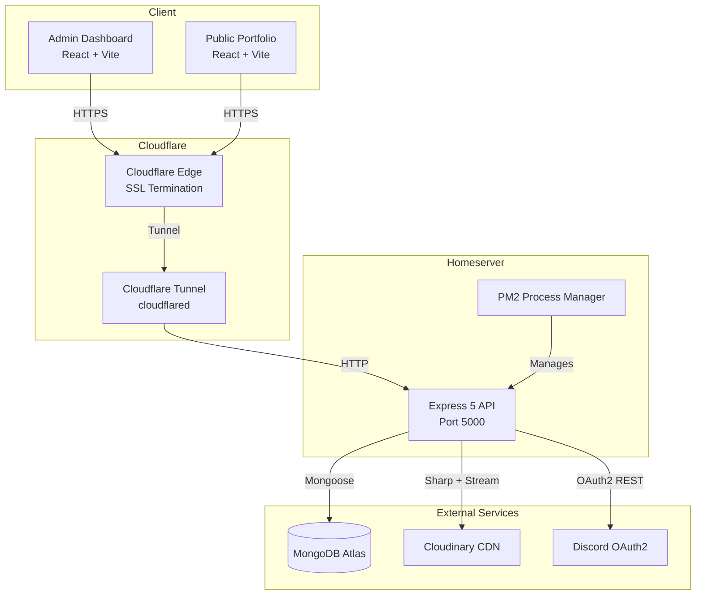
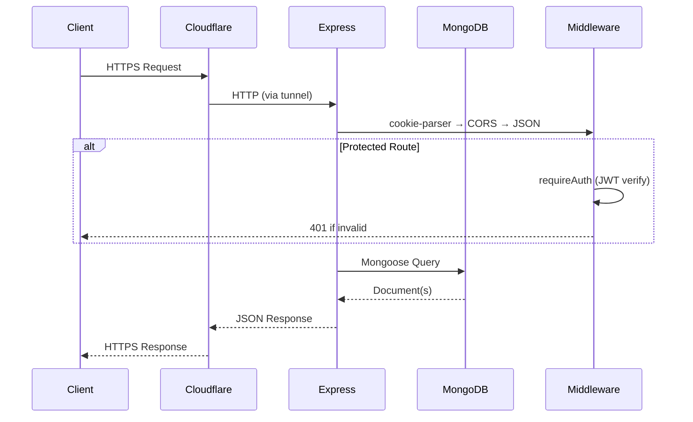
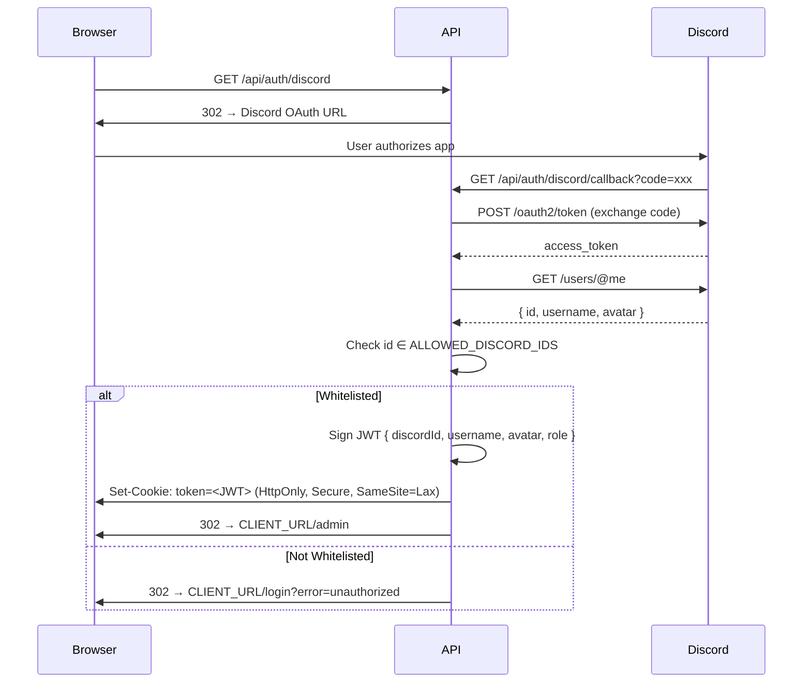
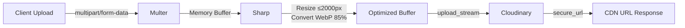
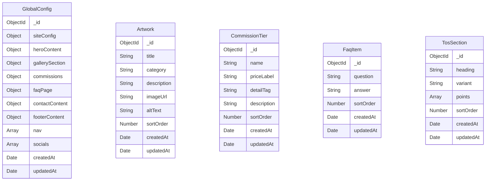
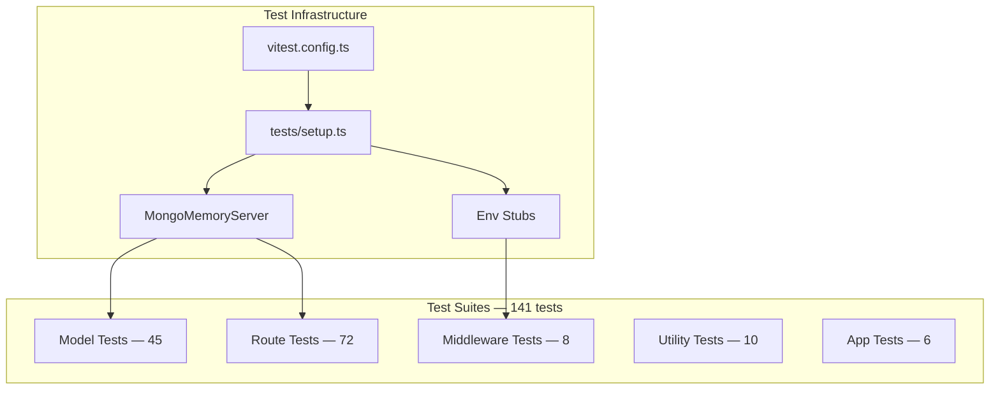
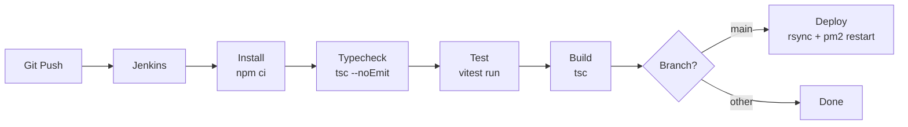

<p align="center">
  
  
  
  
  
</p>

# Cloudy Admin API

> Enterprise-grade CMS REST API powering the [Cloudy Artist Portfolio](https://github.com/Azaken1248). Built with TypeScript, Express 5, Mongoose 9, Discord OAuth2, and Cloudinary.

---

## Table of Contents

- [Architecture](#architecture)
- [Tech Stack](#tech-stack)
- [Project Structure](#project-structure)
- [Getting Started](#getting-started)
- [Environment Variables](#environment-variables)
- [API Reference](#api-reference)
  - [Health](#health)
  - [Authentication](#authentication)
  - [Global Config](#global-config)
  - [Artworks](#artworks)
  - [Commission Tiers](#commission-tiers)
  - [FAQ Items](#faq-items)
  - [TOS Sections](#tos-sections)
  - [Portfolio (Aggregated)](#portfolio-aggregated)
  - [Upload](#upload)
- [Authentication Flow](#authentication-flow)
- [Image Upload Pipeline](#image-upload-pipeline)
- [Error Handling](#error-handling)
- [Database Schema](#database-schema)
- [Testing](#testing)
- [CI/CD Pipeline](#cicd-pipeline)
- [Deployment](#deployment)
- [Security](#security)

---

## Architecture



### Request Flow



---

## Tech Stack

| Layer | Technology | Version |
|---|---|---|
| **Runtime** | Node.js | 20+ |
| **Language** | TypeScript | 5.8 |
| **Framework** | Express | 5.x |
| **Database** | MongoDB (Mongoose) | 9.x |
| **Auth** | JWT + Discord OAuth2 | — |
| **Image Processing** | Sharp | Latest |
| **CDN/Storage** | Cloudinary | v2 |
| **Process Manager** | PM2 | Latest |
| **Tunnel** | Cloudflare Tunnel | Latest |
| **CI/CD** | Jenkins | Pipeline |
| **Testing** | Vitest + Supertest | 4.x |

---

## Project Structure

```
API/
├── Jenkinsfile                    # CI/CD pipeline definition
├── package.json
├── tsconfig.json
├── vitest.config.ts
├── docs/
│   └── DeploymentGuide.md         # Production deployment guide
├── src/
│   ├── server.ts                  # Entry point — bootstrap, listen, graceful shutdown
│   ├── app.ts                     # Express app factory — middleware + route mounting
│   ├── seed.ts                    # Database seeding script
│   ├── config/
│   │   ├── env.ts                 # Typed env var accessor (required + optional)
│   │   ├── db.ts                  # MongoDB connection with auto-reconnect
│   │   └── cloudinary.ts          # Cloudinary SDK configuration
│   ├── middleware/
│   │   ├── auth.ts                # JWT verification from HttpOnly cookie
│   │   ├── errorHandler.ts        # Global error handler (AppError, Mongoose, CastError)
│   │   └── upload.ts              # Multer config — memory, 10MB, image MIME filter
│   ├── models/
│   │   ├── index.ts               # Barrel export for all models
│   │   ├── GlobalConfig.ts        # Singleton site configuration document
│   │   ├── Artwork.ts             # Gallery artwork entries
│   │   ├── CommissionTier.ts      # Commission pricing tiers
│   │   ├── FaqItem.ts             # FAQ question/answer pairs
│   │   └── TosSection.ts          # Terms of service sections
│   ├── routes/
│   │   ├── auth.ts                # Discord OAuth2 flow + session management
│   │   ├── config.ts              # GlobalConfig GET/PUT
│   │   ├── artworks.ts            # Artwork CRUD + batch sort
│   │   ├── commissions.ts         # Commission tier CRUD + batch sort
│   │   ├── faqs.ts                # FAQ CRUD + batch sort
│   │   ├── tos.ts                 # TOS CRUD + batch sort
│   │   ├── portfolio.ts           # Aggregated public endpoint
│   │   └── upload.ts              # Image upload pipeline
│   ├── types/
│   │   ├── index.ts               # Shared TypeScript interfaces
│   │   └── auth.ts                # JWT payload, Discord API types
│   └── utils/
│       ├── errors.ts              # Custom error classes (AppError hierarchy)
│       └── logger.ts              # Colored console logger with timestamps
└── tests/
    ├── setup.ts                   # MongoMemoryServer + env stub
    ├── app.test.ts                # Express app integration tests
    ├── middleware/
    │   └── auth.test.ts           # JWT middleware unit tests
    ├── models/
    │   ├── artwork.test.ts
    │   ├── commissionTier.test.ts
    │   ├── faqItem.test.ts
    │   ├── globalConfig.test.ts
    │   └── tosSection.test.ts
    ├── routes/
    │   ├── artworks.test.ts
    │   ├── auth.test.ts
    │   ├── commissions.test.ts
    │   ├── config.test.ts
    │   ├── faqs.test.ts
    │   ├── portfolio.test.ts
    │   ├── tos.test.ts
    │   └── upload.test.ts
    └── utils/
        └── errors.test.ts
```

---

## Getting Started

### Prerequisites

- Node.js ≥ 20
- MongoDB (local or Atlas)
- Discord Application (for OAuth2)
- Cloudinary Account (for image uploads)

### Installation

```bash
git clone https://github.com/Azaken1248/CloudyPortfolioAdminAPI.git
cd CloudyPortfolioAdminAPI
npm install
```

### Configuration

```bash
cp .env.example .env
# Edit .env with your credentials
```

### Development

```bash
npm run dev        # Start with hot-reload (tsx watch)
npm run seed       # Seed database with sample data
npm run test       # Run all 141 tests
npm run typecheck  # TypeScript type validation
npm run build      # Compile to dist/
```

### Scripts

| Script | Command | Description |
|---|---|---|
| `dev` | `tsx watch src/server.ts` | Dev server with hot-reload |
| `build` | `tsc` | Compile TypeScript to `dist/` |
| `start` | `node dist/server.js` | Run production build |
| `seed` | `tsx src/seed.ts` | Seed database with defaults |
| `test` | `vitest run` | Run test suite |
| `test:watch` | `vitest` | Tests in watch mode |
| `test:coverage` | `vitest run --coverage` | Coverage report |
| `typecheck` | `tsc --noEmit` | Type check without emit |

---

## Environment Variables

| Variable | Required | Default | Description |
|---|---|---|---|
| `PORT` | No | `5000` | Server port |
| `NODE_ENV` | No | `development` | `development` / `production` / `test` |
| `MONGO_URI` | **Yes** | — | MongoDB connection string |
| `JWT_SECRET` | **Yes** | — | Secret for signing JWTs |
| `DISCORD_CLIENT_ID` | **Yes** | — | Discord OAuth2 app client ID |
| `DISCORD_CLIENT_SECRET` | **Yes** | — | Discord OAuth2 app client secret |
| `DISCORD_REDIRECT_URI` | **Yes** | — | OAuth2 callback URL |
| `ALLOWED_DISCORD_IDS` | **Yes** | — | Comma-separated whitelisted Discord user IDs |
| `CLOUDINARY_CLOUD_NAME` | **Yes** | — | Cloudinary cloud name |
| `CLOUDINARY_API_KEY` | **Yes** | — | Cloudinary API key |
| `CLOUDINARY_API_SECRET` | **Yes** | — | Cloudinary API secret |
| `CLIENT_URL` | No | `http://localhost:5173` | Frontend URL for CORS + redirects |

---

## API Reference

All responses follow a consistent envelope:

```json
// Success
{ "success": true, "data": { ... } }

// Error
{ "success": false, "error": { "code": "ERROR_CODE", "message": "Human readable message" } }
```

---

### Health

| Method | Endpoint | Auth | Description |
|---|---|---|---|
| `GET` | `/api/health` | No | Health check |

**Response:**
```json
{
  "success": true,
  "data": {
    "status": "healthy",
    "environment": "production",
    "timestamp": "2026-05-17T19:35:52.923Z"
  }
}
```

---

### Authentication

| Method | Endpoint | Auth | Description |
|---|---|---|---|
| `GET` | `/api/auth/discord` | No | Redirect to Discord OAuth2 |
| `GET` | `/api/auth/discord/callback` | No | OAuth2 callback handler |
| `GET` | `/api/auth/me` | Yes | Get current authenticated user |
| `POST` | `/api/auth/logout` | No | Clear session cookie |

**`GET /api/auth/me` Response:**
```json
{
  "success": true,
  "data": {
    "discordId": "123456789",
    "username": "cloudyartist",
    "avatar": "abc123hash",
    "role": "admin"
  }
}
```

---

### Global Config

Singleton document controlling the entire public site's content.

| Method | Endpoint | Auth | Description |
|---|---|---|---|
| `GET` | `/api/config` | No | Get site configuration |
| `PUT` | `/api/config` | Yes | Update configuration (upsert) |

**`PUT /api/config` Body:** Full or partial GlobalConfig object. Uses `$set` with upsert.

---

### Artworks

| Method | Endpoint | Auth | Description |
|---|---|---|---|
| `GET` | `/api/artworks` | No | List all (sorted by `sortOrder`) |
| `GET` | `/api/artworks/:id` | No | Get single artwork |
| `POST` | `/api/artworks` | Yes | Create artwork |
| `PUT` | `/api/artworks/:id` | Yes | Update artwork |
| `DELETE` | `/api/artworks/:id` | Yes | Delete artwork |
| `PUT` | `/api/artworks/sort` | Yes | Batch update sort order |

**`POST /api/artworks` Body:**
```json
{
  "title": "Starfall OC",
  "category": "Original Character",
  "description": "A celestial-themed original character.",
  "imageUrl": "https://res.cloudinary.com/.../starfall.webp",
  "altText": "Starfall character illustration",
  "sortOrder": 0
}
```

**`PUT /api/artworks/sort` Body:**
```json
{
  "items": [
    { "id": "664a...", "sortOrder": 0 },
    { "id": "664b...", "sortOrder": 1 },
    { "id": "664c...", "sortOrder": 2 }
  ]
}
```

---

### Commission Tiers

| Method | Endpoint | Auth | Description |
|---|---|---|---|
| `GET` | `/api/commissions` | No | List all tiers |
| `POST` | `/api/commissions` | Yes | Create tier |
| `PUT` | `/api/commissions/:id` | Yes | Update tier |
| `DELETE` | `/api/commissions/:id` | Yes | Delete tier |
| `PUT` | `/api/commissions/sort` | Yes | Batch update sort order |

**`POST /api/commissions` Body:**
```json
{
  "name": "Full Illustration",
  "priceLabel": "$120–$180",
  "detailTag": "Full Render / Background",
  "description": "Complete character illustration with background.",
  "sortOrder": 0
}
```

---

### FAQ Items

| Method | Endpoint | Auth | Description |
|---|---|---|---|
| `GET` | `/api/faqs` | No | List all FAQs |
| `POST` | `/api/faqs` | Yes | Create FAQ |
| `PUT` | `/api/faqs/:id` | Yes | Update FAQ |
| `DELETE` | `/api/faqs/:id` | Yes | Delete FAQ |
| `PUT` | `/api/faqs/sort` | Yes | Batch update sort order |

**`POST /api/faqs` Body:**
```json
{
  "question": "How do I commission you?",
  "answer": "Reach out through the contact form.",
  "sortOrder": 0
}
```

---

### TOS Sections

| Method | Endpoint | Auth | Description |
|---|---|---|---|
| `GET` | `/api/tos` | No | List all TOS sections |
| `POST` | `/api/tos` | Yes | Create section |
| `PUT` | `/api/tos/:id` | Yes | Update section |
| `DELETE` | `/api/tos/:id` | Yes | Delete section |
| `PUT` | `/api/tos/sort` | Yes | Batch update sort order |

**`POST /api/tos` Body:**
```json
{
  "heading": "Usage Rights",
  "variant": "info",
  "points": ["Personal use allowed.", "Commercial use requires a license."],
  "sortOrder": 0
}
```

`variant` must be one of: `default`, `prohibited`, `info`

---

### Portfolio (Aggregated)

| Method | Endpoint | Auth | Description |
|---|---|---|---|
| `GET` | `/api/portfolio` | No | Full portfolio data for public site |

Returns the complete `PortfolioData` shape by aggregating GlobalConfig + all collections in parallel. This is the single endpoint the public site calls to hydrate its `usePortfolio()` hook.

**Response shape:**
```json
{
  "success": true,
  "data": {
    "siteConfig": { ... },
    "heroContent": { ... },
    "gallerySection": { ... },
    "commissions": { ... },
    "faqPage": { ... },
    "contactContent": { ... },
    "footerContent": { ... },
    "nav": [ ... ],
    "socials": [ ... ],
    "artworks": [ ... ],
    "commissionTiers": [ ... ],
    "faqItems": [ ... ],
    "tosSections": [ ... ]
  }
}
```

---

### Upload

| Method | Endpoint | Auth | Description |
|---|---|---|---|
| `POST` | `/api/upload` | Yes | Upload and optimize image |

**Request:** `multipart/form-data` with field name `image`

**Response:**
```json
{
  "success": true,
  "data": {
    "url": "https://res.cloudinary.com/your-cloud/image/upload/cloudy-portfolio/abc123.webp"
  }
}
```

**Constraints:**
- Max file size: 10MB
- Accepted MIME types: `image/jpeg`, `image/png`, `image/webp`, `image/gif`
- Output: WebP at 85% quality, max 2000px wide

---

## Authentication Flow



**Key details:**
- No `discord.js` — uses raw `fetch()` against Discord REST API v10
- JWT expires in 7 days, stored in `HttpOnly` cookie (not accessible to JavaScript)
- `Secure` flag auto-enabled when `NODE_ENV=production`
- Whitelist enforced via `ALLOWED_DISCORD_IDS` env var (comma-separated)

---

## Image Upload Pipeline



| Stage | What it does |
|---|---|
| **Multer** | Receives file in memory buffer, validates MIME type, enforces 10MB limit |
| **Sharp** | Resizes to max 2000px wide (no enlargement), converts to WebP at 85% quality |
| **Cloudinary** | Streams optimized buffer to `cloudy-portfolio` folder, returns CDN URL |

---

## Error Handling

All errors pass through a centralized error handler that maps to consistent JSON responses:

| Error Type | HTTP Status | Code |
|---|---|---|
| `ValidationError` (Mongoose) | 400 | `VALIDATION_ERROR` |
| `CastError` (invalid ObjectId) | 400 | `INVALID_ID` |
| `UnauthorizedError` | 401 | `UNAUTHORIZED` |
| `ForbiddenError` | 403 | `FORBIDDEN` |
| `NotFoundError` | 404 | `NOT_FOUND` |
| `ConflictError` (duplicate key) | 409 | `CONFLICT` |
| Unhandled errors | 500 | `INTERNAL_ERROR` |

Stack traces are included in development responses only. Production responses sanitize error messages for unhandled errors.

---

## Database Schema



**Notes:**
- `GlobalConfig` is a **singleton** document — `PUT /api/config` uses upsert
- All sortable collections use `sortOrder` field with ascending index
- `TosSection.variant` is an enum: `default | prohibited | info`
- All models use Mongoose `timestamps: true` for automatic `createdAt`/`updatedAt`

---

## Testing

```bash
npm run test           # Run all tests
npm run test:watch     # Watch mode
npm run test:coverage  # Coverage report
```

### Test Architecture



| Suite | File | Tests |
|---|---|---|
| Express App | `tests/app.test.ts` | 6 |
| Auth Middleware | `tests/middleware/auth.test.ts` | 8 |
| Error Utils | `tests/utils/errors.test.ts` | 10 |
| Artwork Model | `tests/models/artwork.test.ts` | 12 |
| CommissionTier Model | `tests/models/commissionTier.test.ts` | 7 |
| FaqItem Model | `tests/models/faqItem.test.ts` | 7 |
| GlobalConfig Model | `tests/models/globalConfig.test.ts` | 10 |
| TosSection Model | `tests/models/tosSection.test.ts` | 9 |
| Auth Routes | `tests/routes/auth.test.ts` | 15 |
| Config Routes | `tests/routes/config.test.ts` | 6 |
| Artwork Routes | `tests/routes/artworks.test.ts` | 15 |
| Commission Routes | `tests/routes/commissions.test.ts` | 10 |
| FAQ Routes | `tests/routes/faqs.test.ts` | 10 |
| TOS Routes | `tests/routes/tos.test.ts` | 10 |
| Portfolio Routes | `tests/routes/portfolio.test.ts` | 3 |
| Upload Routes | `tests/routes/upload.test.ts` | 3 |
| **Total** | **16 files** | **141** |

**Key testing patterns:**
- **MongoMemoryServer** — in-memory MongoDB, zero external dependencies
- **Collection cleanup** — `afterEach` wipes all collections to prevent test pollution
- **Discord API mocking** — `vi.spyOn(globalThis, 'fetch')` for OAuth flow tests
- **JWT test helpers** — `authCookie()` utility generates valid admin cookies for protected route tests

---

## CI/CD Pipeline



**Pipeline stages (Jenkinsfile):**

| Stage | Command | Runs On |
|---|---|---|
| Install | `npm ci` | Every push |
| Typecheck | `npm run typecheck` | Every push |
| Test | `npm run test` | Every push |
| Build | `npm run build` | Every push |
| Deploy | `rsync` → `pm2 restart` | `main` branch only |

Deploy uses `rsync` to sync built files to the deploy directory, then restarts the PM2 process. The `.env` file is preserved (excluded from rsync).

---

## Deployment

The API is deployed on a homeserver using **Cloudflare Tunnel** — no open ports, no Nginx, no Certbot.

```
Browser ──HTTPS──▶ Cloudflare Edge ──tunnel──▶ cloudflared ──HTTP──▶ localhost:5000 (Express)
```

See [docs/DeploymentGuide.md](docs/DeploymentGuide.md) for the full step-by-step guide.

### Production Env Changes

| Setting | Local | Production |
|---|---|---|
| `NODE_ENV` | `development` | `production` |
| `DISCORD_REDIRECT_URI` | `http://localhost:5000/api/auth/discord/callback` | `https://api.yourdomain.com/api/auth/discord/callback` |
| `CLIENT_URL` | `http://localhost:5173` | `https://yourdomain.com` |
| Cookie `Secure` | `false` | `true` (automatic) |

---

## Security

| Measure | Implementation |
|---|---|
| **Authentication** | Discord OAuth2 → JWT in HttpOnly cookie |
| **Authorization** | Strict whitelist via `ALLOWED_DISCORD_IDS` |
| **Cookie Security** | `HttpOnly`, `Secure` (production), `SameSite=Lax` |
| **CORS** | Locked to `CLIENT_URL` origin with credentials |
| **Input Validation** | Mongoose schema validators on all models |
| **Error Sanitization** | Production responses hide stack traces and internal errors |
| **File Upload** | MIME type whitelist, 10MB limit, Sharp processing |
| **Proxy Trust** | `trust proxy` enabled for Cloudflare `X-Forwarded-*` headers |
| **Graceful Shutdown** | SIGTERM/SIGINT handlers with 10s timeout |
| **No Open Ports** | Cloudflare Tunnel — outbound connection only |

---

<p align="center">
  Made with by <a href="https://github.com/Azaken1248">Azaken</a>
</p>
