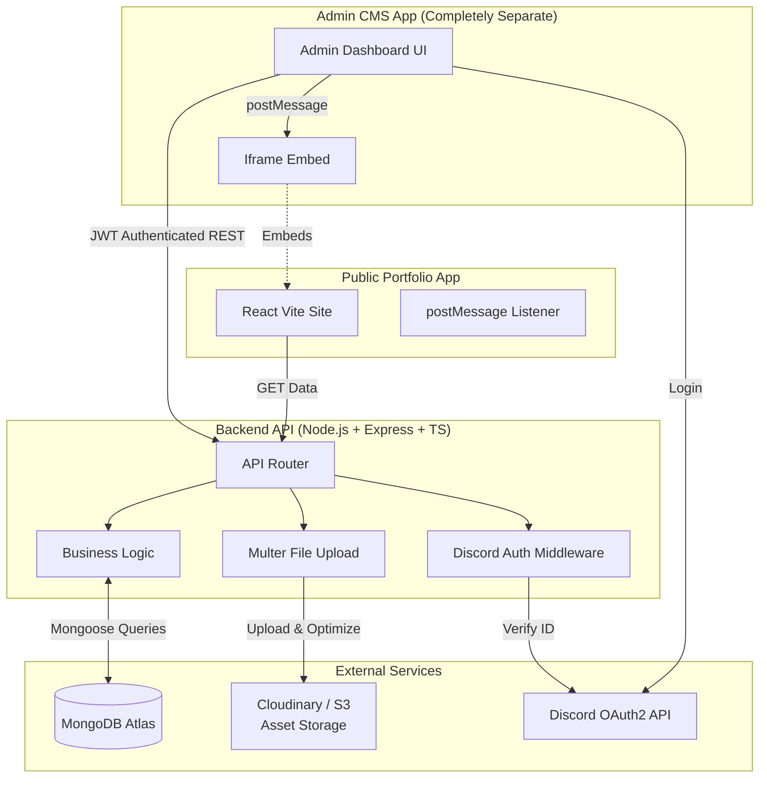
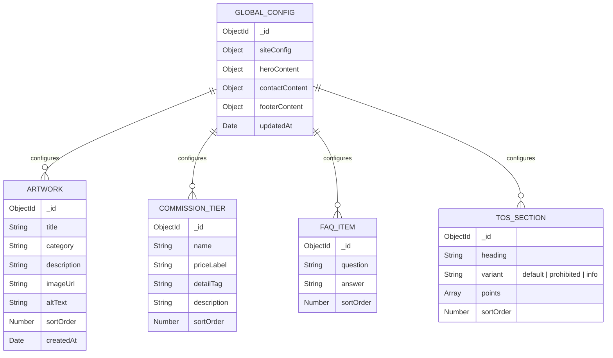
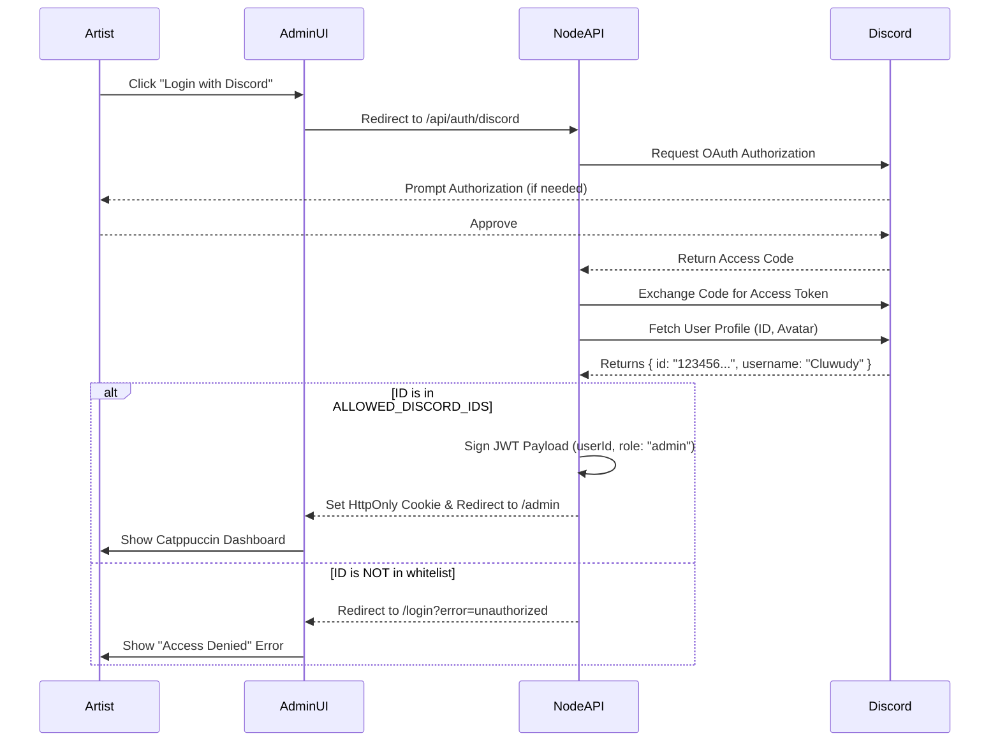
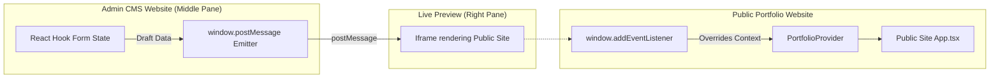

# System Design: Artist Portfolio Admin CMS

## 1. Executive Summary
This document outlines the comprehensive system architecture, database design, and UI/UX strategy for the **Cloudy Artist Portfolio Content Management System (CMS)**. 

### Core Requirements Addressed
As requested in the project comments, the system is designed to allow the artist to intuitively:
- **Upload, organize, and remove artworks** seamlessly.
- **Add, edit, or remove FAQs and TOS Rule sections** dynamically.
- Modify site configuration, hero content, commission tiers, and social links.

The platform will feature a **"Live Preview"** editor, enabling the artist to see changes in real-time on the actual site layout before saving. The entire admin interface will be styled with a clean, developer-friendly **Catppuccin (Macchiato) theme with Pink accents**. Access is strictly secured via **Discord OAuth2**, restricting login solely to whitelisted users (the artist).

---

## 2. High-Level System Architecture

The architecture relies on a decoupled React Frontend (Client & Admin) and a Node.js REST API backed by MongoDB.

---

## 3. Database Architecture (MongoDB)

To support seamless addition and removal of items (artworks, FAQs, etc.), the data is normalized into specific MongoDB collections. This prevents the document size from exceeding limits and makes individual updates incredibly fast.

### Drag-and-Drop Sorting
Notice the `sortOrder` field on lists (Artworks, FAQs, TOS). When the artist drags and drops an item in the Catppuccin UI to reorder it, the frontend sends a batch `PUT /api/sort/{collection}` request to update the `sortOrder` integers, preserving the exact arrangement desired.

---

## 4. Authentication & Security (Discord OAuth)

The system avoids traditional passwords. The artist authenticates via their Discord account. The backend verifies the Discord User ID against a hardcoded environment variable whitelist.

---

## 5. UI/UX Design System (Catppuccin Mocha + Pink)

The interface is built for a non-technical artist, emphasizing visual clarity, soft colors, and direct manipulation. 

### Color Palette Specification (Mocha)
- **Base Background (`#1E1E2E`):** The main backdrop of the admin app. Deep, rich, dark tone.
- **Surface Panels (`#313244`):** Used for sidebar backgrounds, form cards, and list items.
- **Primary Accent / Pink (`#F5C2E7`):** Used for the "Save Changes" buttons, active navigation states, toggle switches, and focus rings around inputs.
- **Text Primary (`#CDD6F4`):** Soft, high-readability text for form labels and descriptions.
- **Text Secondary (`#A6ADC8`):** Placeholder text and helper notes.
- **Danger/Delete (`#F38BA8`):** Red accent for "Remove Artwork" or "Delete FAQ" buttons.

### Layout Architecture (3-Pane View)
1. **Left Pane (Navigation - 250px):** 
   - Logo, Discord Profile Info.
   - Tabs: Global Config, Hero Section, Gallery, Commissions, FAQ & TOS, Contact.
2. **Middle Pane (Editor Workspace - 450px):**
   - Renders the fields for the active tab.
   - Features **React Hook Form** for instantaneous validation.
   - Uses `react-beautiful-dnd` or `@dnd-kit/core` for drag-and-drop reordering of lists (like Artworks).
   - "Add New Artwork" button opens a modal or expands a card to drop an image file.
3. **Right Pane (Live Preview - Flex 1):**
   - The "Killer Feature." Displays the actual portfolio site.
   - Toggles for Desktop/Tablet/Mobile viewports.

---

## 6. Live Preview Engine (Headless Iframe Injection)

Since the Admin Dashboard and the Public Portfolio are **completely separate websites**, the live preview operates via a secure `iframe` message-passing architecture.

1. The Admin Panel embeds the Public Site URL inside an `<iframe src="https://public-site.com?preview=true" />`.
2. As the artist types, React Hook Form generates a draft `PortfolioData` object.
3. The Admin Panel sends this object across the browser boundary using `iframe.contentWindow.postMessage()`.
4. The Public Site detects it's running in preview mode, listens for these messages, and immediately updates its local `usePortfolio` context.
5. **Result:** Real-time live preview is achieved without the Admin Panel needing to bundle the Public Site's code.

---

## 7. Asset Upload Pipeline

When the artist adds a new artwork or changes the Hero image:
1. The user clicks "Upload Image" in the Catppuccin UI.
2. The frontend sends a `multipart/form-data` POST request to Node.js.
3. **Multer** intercepts the file in memory.
4. **Sharp (Node.js)** optionally resizes and converts the image to WebP for optimal portfolio loading speed.
5. The backend streams the optimized image to **Cloudinary** or **AWS S3**.
6. The backend returns the secure, public CDN URL (e.g., `https://res.cloudinary.com/.../artwork.webp`).
7. The Admin UI inserts this URL into the `draftFormState` and updates the MongoDB `ARTWORK` record.

---

## 8. Phased Implementation Roadmap

To ensure a clean separation of concerns, the implementation is divided into distinct Backend and Frontend tracks.

### Part A: Backend API Implementation (Node.js)

**Phase 1: Backend Infrastructure & Database**
- Initialize Node.js TypeScript project.
- Set up MongoDB Atlas cluster and connect via Mongoose.
- Implement the 5 Mongoose Schemas (Global, Artwork, Commission, Faq, Tos).

**Phase 2: Authentication & Security**
- Implement Discord OAuth2 Passport strategy.
- Build User ID whitelisting logic via environment variables.
- Setup JWT issuance and HTTP-only cookie middleware for secure session management.

**Phase 3: REST API & Asset Pipeline**
- Create comprehensive CRUD routes (`GET`, `POST`, `PUT`, `DELETE`) for all collections.
- Implement the `/api/sort` endpoints for handling drag-and-drop array reordering.
- Integrate Multer and Cloudinary API for the `/api/upload` endpoint.
- Write a seed script to migrate the hardcoded `portfolio.ts` data into MongoDB.

### Part B: Admin Frontend Implementation (React CMS)

**Phase 4: Admin UI Foundation & Routing**
- Scaffold a completely new, separate React application for the Admin CMS.
- Integrate the Catppuccin Mocha Tailwind plugin/colors.
- Build the core layout: Sidebar navigation, Topbar, and the 3-pane responsive grid.

**Phase 5: Auth Flow & Discord UI**
- Build the Discord login landing page.
- Implement React context for Authentication state.
- Wire up the redirect flow to the Node.js `/api/auth/discord` endpoint.

**Phase 6: CMS Form Editors & Logic**
- Set up TanStack React Query for fetching/caching the API data.
- Build the generic form builders using React Hook Form.
- Implement specialized list editors (e.g., `react-beautiful-dnd` for dragging to reorder artworks).
- Wire up the "Save Changes" pink accent button to execute `PUT`/`POST` requests to the API.

**Phase 7: Iframe Preview Integration**
- Embed an `iframe` pointing to the public site's URL inside the Right Pane.
- Wire up the `window.postMessage` emitter to push React Hook Form draft data into the iframe as the user types.

### Part C: Public Portfolio Integration

**Phase 8: Data Fetching & Preview Listener**
- Modify the main portfolio website's `main.tsx`.
- Replace the static `defaultPortfolio` import with a React Query hook fetching `GET /api/portfolio`.
- Add a sleek loading skeleton or spinner that matches the Cloudy branding.
- Add a `window.addEventListener("message")` to intercept draft data from the Admin iframe, overriding the `usePortfolio` context in real-time.
